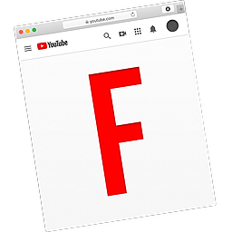

## 🎉 New Milestone: Thanks to the non-disabled users purchasing AppShox's applications, we've been able to surpass $5,000 donated to the Durham Nursing and Rehabilitation Center.

# Appccessibility Shox

Appccessibility Shox is a 501(c)(3) which develops applications to improve the accessibility of the web. If you're interested in any of our products for an accessibility need, please email us at shockerellaapps@gmail.com for a 100% discount. All proceeds from all products are donated to the Durham Nursing and Rehabilitation Center (DNRC), a grossly underfunded public nursing home in Durham, NC. All applications are open source and do not collect user data.

## Products

<h3 align="left">
  
     Keys for Safari
  
</h3>
[Keys for Safari](https://apps.apple.com/us/app/keys-for-safari/id1494642810?mt=12) is an application that makes navigating the web faster than ever for power users and makes the web more accessible to those with physical disabilities. For those with a physical disability, please email shockerellaapps@gmail.com for a 100% discount (no questions asked).

<h3 align="left">
  
     Focus for YouTube
  
</h3>
[Focus for YouTube](https://apps.apple.com/us/app/focus-for-youtube/id1514703160?mt=12) enables users to streamline their video browsing experience. Whether you work on YouTube and are tired of the distractions, or whether you're a teacher who'd rather keep their recommended videos private while screencasting, you'll be able to fix YouTube to your liking within the Focus app. Since Focus disables the loading of many thumbnails, it will also speed up your browsing.

<h3 align="left">
  
     Transcript Reader
  
</h3>
[Transcript Reader](https://apps.apple.com/us/app/transcript-reader/id1595490573) extends the concept of Safari's default "reader mode" beyond the domain of articles and into subtitles. It's great for students who want to be able to select, copy, or Quick Note portions of a lecture, people who have trouble focusing on the content of a video (such as those with ADHD), or those who have trouble reading subtitles. If you have ADHD, a visual or hearing impairment, or another accessibility need, please email shockerellaapps@gmail.com for 100% off (no questions asked). 

<h3 align="left">
  
     Vocabulary Log
  
</h3>
[Vocabulary Log](https://apps.apple.com/us/app/vocabulary-log/id1556420310?mt=12) is a great tool for expading your vocabulary and for English-as-a-second-language learners.

<h3 align="left">
  
     Vocabulary Log
  
</h3>
Tired of seeing Oculus, Townhall, and Marketplace? [Simplifier for Facebook](https://apps.apple.com/us/app/simplifier-for-facebook/id1509832815?mt=12) is a browser extension that enables users to streamline Facebook's cluttered UI.

## Support/Contact

For support, please email shockerellaapps@gmail.com.

## Get Involved

Appccessibility Shox is currently recruiting members of the disabled community to join a review panel to provide the ideas and feedback that will drive future initiatives. No coding ability is required. The review panel will be an unpaid position that meets virtually from 7:00-8:30 PM EST on the first Sunday of every third month with the next meeting being on November 7, 2021. The time commitment is very flexible, though, and we will be respectful of your time. As a member, you also get free access to all of Appccessibility Shox’s apps. If this sounds like something you would be interested in, **please** reach out to shockerellaapps@gmail.com.
Additionally, non-disabled people can reach out to discuss other ways to get involved based on skillset.

## In the News
- [Keys für Safari: Klasse Erweiterung gestattet Tastatur-Navigation](https://www.ifun.de/keys-fuer-safari-klasse-erweiterung-gestattet-tastatur-navigation-149410/)
- [Webページ上のリンクやメニューをキーボードだけで操作できるSafari機能拡張「Keys for Safari」がリリース。](https://applech2.com/archives/20200122-keys-for-safari-extension-web-keyboard-navigation.html)
- [Keys for Safari, une extension pour naviguer uniquement au clavier](https://www.macg.co/logiciels/2020/01/keys-safari-une-extension-pour-naviguer-uniquement-au-clavier-111489)
- [YouTubeに表示される、おすすめや急上昇、サイドバーの関連動画、コメントなどを非表示にしてくれるSafari機能拡張「Focus for YouTube」がリリース。](https://applech2.com/archives/20200829-focus-for-youtube-safari-extension.html)
- [Transcript Reader listed as one of the top 6 best apps of the week 11/19/21 by appadvice.com](https://appadvice.com/best-ios-apps-of-the-week/november-14-2021)
